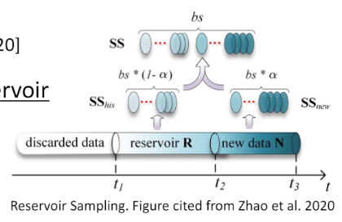
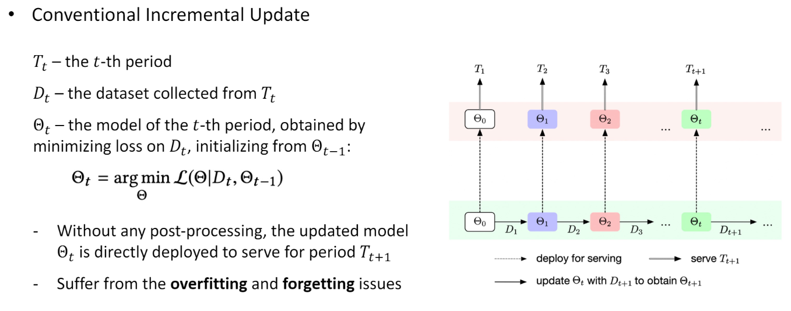
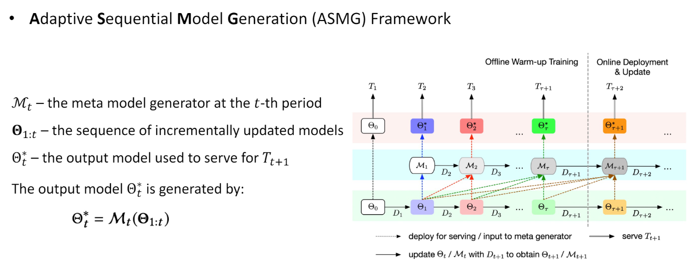
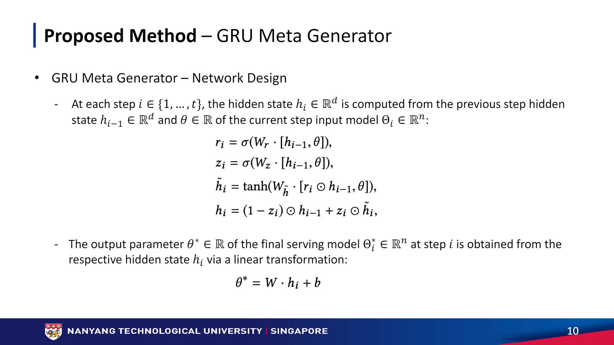
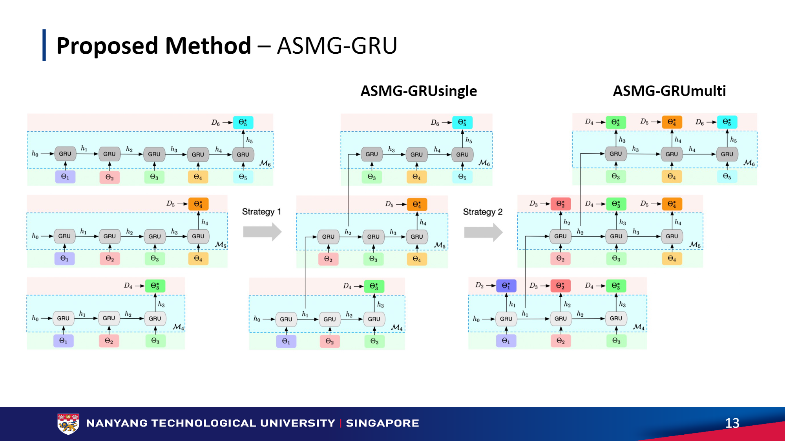
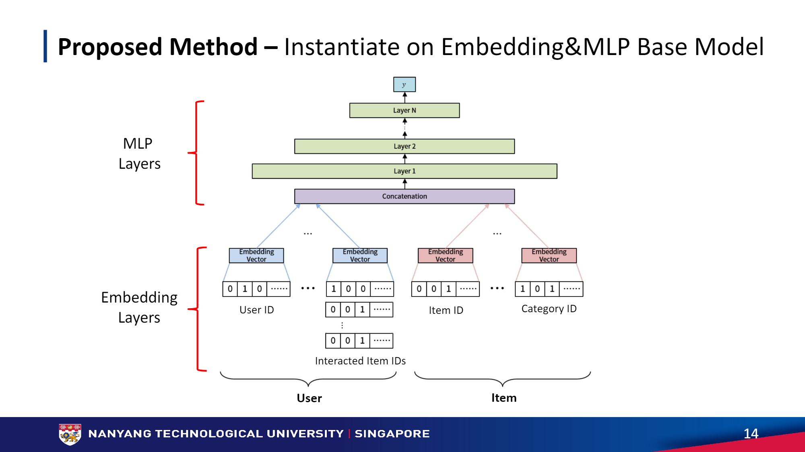

# Adaptive Sequential Model Generator for Incrementally Updating Recommender Systems      

* Reviewer : 김가윤   
* Date : 2022-05-13   
* slides : https://github.com/danni9594/ASMG/blob/master/slide.pdf
   
## ABSTRACT   
* ASMG framework generates a better serving model from sequence of historical models via a meta generator, 메타 생성기를 통해 모델 히스토리를 가지고 더 나은 모델을 생성한다.   
* 메타 생성기를 만들 때 Gated Recurrent Units, GRUs 사용 해서 long term dependencies 포착해 ability를 최대화한다   
 

## INTRODUCTION   
* 업데이트가 중요해진 요즘, 새로운 데이터가 나타날 때마다 시기적으로 업데이트를 하는 것이 중요   
* 이전 연구에서는 새롭게 나타난 데이터 (incremental update)만 혹은 슬라이딩 윈도를 사용해 w 시기만을 업데이트 가능 (batch update), incremetal update가 주로 많이 사용되지만 = BUT, forgetting problem   
* Main focus : How to effectively transfer past knowledge especially useful for future predictions?   
* 문제 해결을 위한 2가지 방법 : sample-based approach, model-based approach = long-term sequential patterns를 무시한다는 한계가 있다.    
    * Continual learning에서 고안한 방법들
    * 해결을 위해 ASMG 고안
    * 과거 지식을 뽑아서 다음 시기 데이터에 최적화 하도록 train   
    * long term dependencies 강화하기 위해 GRUs 사용   

    

## RELATED WORK   
### Continual Learning   
* Continual learning 종류 3가지 : Experience replay, Regularization-based, Model Fusion    
    * Continual learning : 현 데이터만 학습하게 되는 (과거 데이터를 기억하지 못하는) 문제점을 해결하기 위한 연구 분야
1. Experience Replay    
    *  업데이트 시 새로운 데이터와 과거 샘플들을 같이 재사용하면서 forget 문제를 해결    
2. Regularization based   
    * 중요도에 따라 파라미터 업데이트를 제한해 과거 지식을 얻는 것    
3. Model fusion    
    * 점진적으로 sub-networks를 포함하면서 continual learning   

    = RS에서도 잘 작동시키기 위해 여러 방법 고안 중

### Sample-based Approach   
* RSs incremental update에서 생기는 forgetting issue 해결 방법 중 하나, continual learning에서 착안   
* Short term interest & Long term memory 사이에서 aiming to find the balance
* Reusing historical samples 하기 때문에 1번과 유사하다고 볼 수 있음   
* Reservoir : keep a random sample of history
* Heuristics : Designed to Reservoir에서 샘플들 골라서 모델 업데이트, 새로운 데이터 우선시 할지 or 과거 데이터 버릴지...    
* *문제점* : individual samples, 전체 분포의 큰 그림을 재현하기 충분치 않다. = 전체를 충분하게 대표하지 못한다   
    -> past, present models 사이에서 knowledge transfer하는 model based approach 등장   
   

### Model-based Approach   
* Regularization based와 유사, 모델 파라미터 업데이트 위해 knowledge distillation loss 사용하기 때문   
    cf. [딥러닝 모델 지식의 증류, Knowledge distillation과 loss에 관하여](https://baeseongsu.github.io/posts/knowledge-distillation/)
* 그러나 제한만 한다고 해서 knowledge가 future prediction에 useful하다고 볼 수 없다.   
* 이에 관련해 고안된 *Sequential Meta Learning(SML)* !!   
    - 이전 모듈을 과거와 현재 모델에 결합하도록 설계하고, 순차적 방식으로 적응적으로 훈련하여 향후 서비스를 최적화   
* *문제점* : ONLY 연속적인 periods들의 transfer만 고려한다.   
 

## METHODOLOGY   
### Problem Discription   
* Conventional Incremental Update in RS : (RNN처럼) last period model을 initialize 하는데 쓰고, 새로운 데이터와 업데이트한다, Overfitting 문제 & Forget past patterns learned   
* Dt = current data, initialize with theta t-1(이전 것으로 initialize) -> minimize the loss

   

### ASMG Framework   
* 전통적인 방법과 달리 바로 deploy하지 않고, meta generator 사용 (과거 모델, newly updated one까지 포함한 것)   
* 다음 기간 데이터를 위해 출력 모델을 적응적으로 최적화하여 메타 생성기를 업데이트할 것을 제안   
* Input sequence model = Regular incremental update로부터 얻어지기 때문에 each period의 모델은 그 시기의 데이터로만 train된다.   
    * 각 period를 잘 나타낸다고 볼 수 있음 (Sample based 접근의 문제점 보완한듯?)   
* theta 0는 제외, randomly initialized 되었기 때문이다.
* omega t+1 = arg min Loss (theta*t| Dt+1, omega t)   
* Online model generatoin 하기 전에 Offline으로 warm-up training 진행(온라인이라 함은, 새로운 데이터가 준비되는 대로 실시간으로!!)   

### GRU Meta Generator   
cf. [GRU(Gated Recurrent Unit)](https://wikidocs.net/22889)   
cf. [GRU in detail](https://yjjo.tistory.com/18)    
* Sequential patterns 포착하기 위해 GRU 사용하며 베이스 모델의 좌표 별로 GRU meta generator 적용   
* ri = reset, 직전시점 은닉층 + 현 시점 가중치   
* zi = update, 과거 현재 최신화 비율 결정   
* h~i = candidate   
* hi = update + candidate, 은닉층 계산   

### Training Strategies  
- Training efficiency & Sequential modeling improve 위한 training stratgies 
1. Training GRU Meta Generatror on Truncated Sequence   
    * GRU의 단점 중 하나로 시퀀스 길이에 따라 계산 시간이 증가한다는 것이었으므로 이전에 학습된 은닉 상태(hidden state)를 계속하여 잘린 시퀀스에서 GRU 생성기를 훈련할 것을 제안   
    * 다대일 many to one
    * ASMG-GRU single   

2. Training GRU Meta Generator at Multiple Steps Concurrently   
    * 여러 단계에서 동시 훈련하기   
    * last model에만 최적화 하는 것이 아니라 전체 output model과 데이터에 동시에 최적화, 최근 데이터에 가중치를 더 줌   
    * 초기 기간의 데이터가 기본 모델 대신 메타 생성기를 훈련시키는 데 사용되기 때문에 배치 업데이트와 구별되어야   
    * ASMG Framework에 있는 GRU meta generator을 ASMG-GRU라고 한다.   
    * 다대다 many to many
    * ASMG-GRU multi   

   

### Instantiation on Embedding & MLP Base Model   
* ASMG-GRU의 효과를 측정하기 위해 딥러닝 기반의 임베딩 & 멀티 레이어 퍼셉트론 모델을 인스턴스화   
* 모델은 주로 고차원 희소 피처를 저차원 밀도 벡터로 변환하는 임베딩 레이어(Sparse to dense)와 연결된 피처 임베딩의 상호 작용을 학습하는 MLP 레이어로 구성   

    
 

## Experiments   
* Interaction의 의미 = activity log, 물건 산 것   
* [Tmall](https://tianchi.aliyun.com/dataset/dataDetail?dataId=42)   
* [Sobazaar](https://github.com/hainguyen-telenor/Learning-to-rank-from-implicit-feedback)   
* MovieLens   
* Lazada   
* 30개 최근 긍정적 피드백을 모아서 user sequence feature을 만들었다. **긍정적 피드백 = 구매했다는 것으로 이해**   

### Comparison with Baselines   
* Performance drops as window size increases = 시퀀스 계산 길어져서   
* Model-based > Sample-based   
* GRU meta generator design이 성능이 좋았다.   

### Ablation Study   
* ASMG-GRUfull, zero, single 변형을 통해 성능 측정 하였다.   
* GRU multi일 때가 시간이 더 적게 들었고, 성능 측면에서도 비슷   

### Sensivitivy Analysis   
* Effect of Input Sequence Length = Optimal was 3-4 periods   
* Effect of GRU Hidden Size = 4 Units
