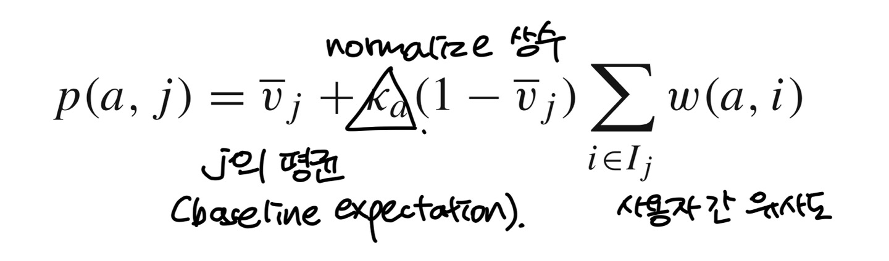
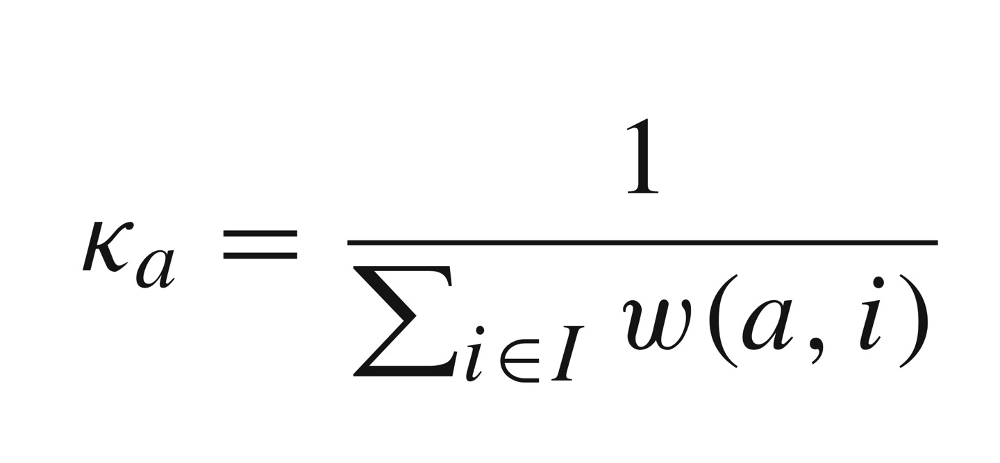

# Time to CARE : a collaborative engine for practical disease prediction   

## Abstract   
* CARE   
    * 환자들의 의료 기록을 활동해 환자들의 병 예측   
    * Collaborative filtering 사용하여 개인 의료 기록과 비슷한 환자들의 병을 예측   

* ICARE
    * Iterative version   
    * 향상된 성능을 위한 앙상블 개념을 통합   
    * Apply time-sensitive modifications   

## Introduction   
* 현재의 의료는 선제적 치료가 아니라 질병의 증상이 나타나면 즉시 개입하여 초기 징후에 질병을 치료하는 사후적 치료   
* genome revolution에 의해 이점을 보고 있으나 단점도 존재   
* phenotype : 표현형(表現型, phenotype) 또는 발현형질(發現形質)은 생명학에서, 생명체가 유전적인 정보를 이용하여, 세포, 조직 및 개체에 단백질과 당을 통해 생산한 기능적 형질   
* 본 논문의 목표는 표현형과 질병 이력 기반 접근이 질병 예측에 탁월하다는 것을 보여주는 것 :smiley:   
   

### Contribution   
* Collaborative filtering methodology   
* Each user is a patient whose profile is a vector of diagnosed diseases(진단 병명).   
* Ratings = Binary (환자가 병이 있으면 1, 없으면 0), 음악과 영화와 달리 유저가 선택하는 것이 아님   
1. International classification of Disease code를 사용한다.   
2. 사용된 협업 필터링 방법은 이전 작업을 기반으로 하며 CARE 내에서 의미 테스트 및 앙상블 방법의 새로운 요소를 통합   
3. A time sensitive   
   
## Data   
* Input : 각 환자의 방문 마다의 질병 이력 ICD-9 코드   
* 각 데이터 기록은 환자 ID로 표시되는 병원 방문과 방문당 최대 10개의 진단 코드 목록으로 구성   
* num of visit range 1~255  

## The CARE Methodology   
### System Overview   
* Testing patient(denoted as a), Training patients(denoted as I, individuals i)   
* Training set은 협력 필터링을 적용하기 전에 테스트 환자와 공통된 질병이 두 개 이상 있는 환자로 제한    
    * Test patient a 와 가장 비슷한 group of patients가 모이게 된다.   
* 이후 collaborative filtering 적용, ICARE의 경우 각 환자마다 multiple times를 하여 각 질병에 매번 different training patient group을 만든다. 다수의 겨과 예측은 앙상블을 형성하기 위한 것이다.   
* Output은 ranked list   
   
### Vector Similarity   
1. 용어 정리   
* p(a, j) : a가 disease(item) j를 사용할, 가질 예측값   
* a = active user(testing), every other user i (previously given a vote vi,j for item j)   
* I = The entire training set of users, Ij = the subset of users who've voted on j   
* w(a, i) : vector similarity btw users a and i   
2. w(a, i)   
   
a와 i가 얼마나 비슷한지 측정한다.   
cf. 코사인 유사도는 두 벡터 간의 코사인 각도를 이용하여 구할 수 있는 두 벡터의 유사도를 의미, 두 벡터의 방향이 완전히 동일한 경우에는 1의 값을 가지고, 90도의 각을 이루면 0의 값, 180도로 반대의 방향을 가지면 -1의 값을 가진다. 즉, -1 이상 1이하의 값을 가지며 값이 1에 가까울수록 유사도가 높다고 판단   
3. p(a, j)   
   

### Inverse Frequency   
### Grouping of training patients   
### ICARE with ensembles   
### ICD-9CM code collapse  

## Time-sensitive CARE

