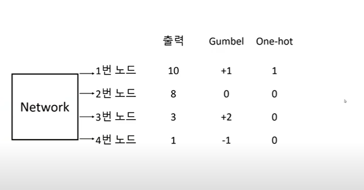
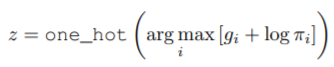
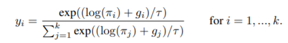
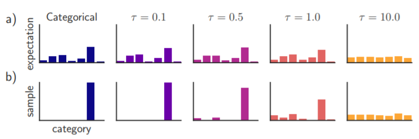
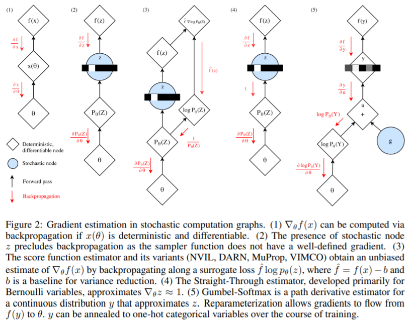
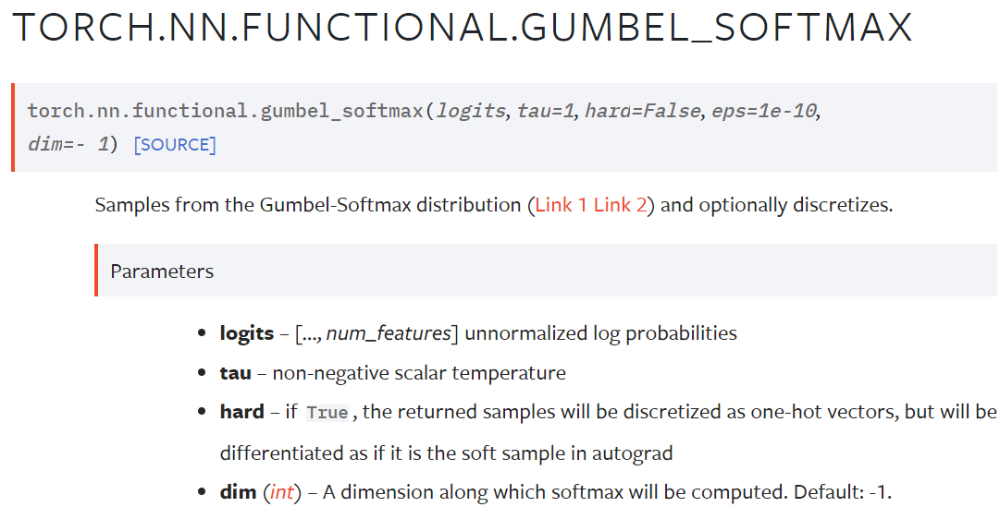
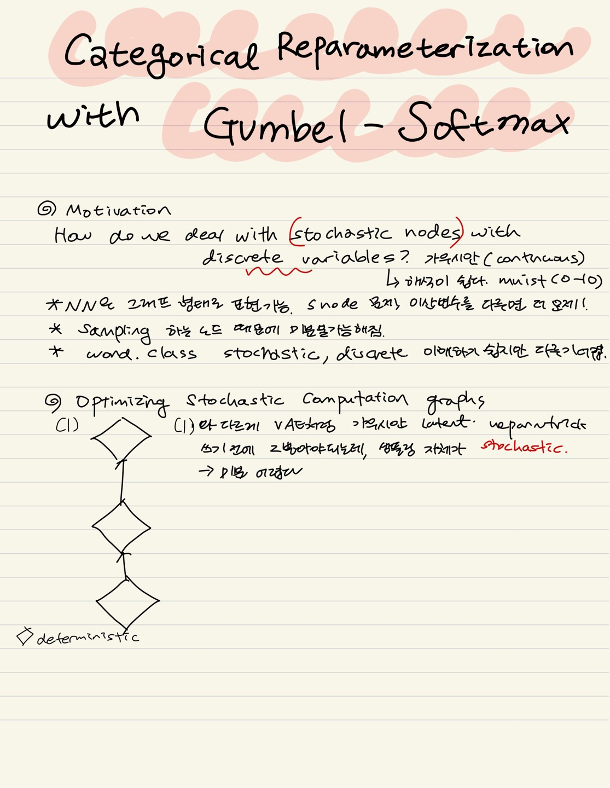
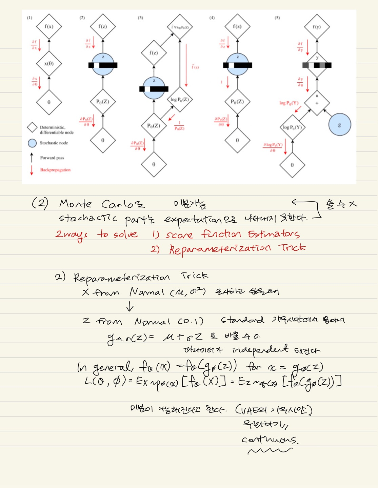
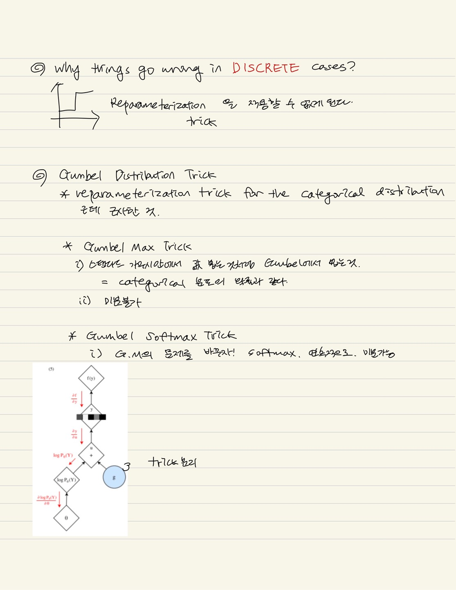

# Categorical Reparameterization with Gumbel Softmax   
## Abstract
* 확률적 NN들은 Categorical 잠재 변수들을 역전파가 불가능하기 때문에 잘 사용하지 않음
* 본 논문에서는 새로운 Gumbel softmax 분포로 부터의 sample을 사용해 효율적인 gradient estimator을 선보임

## Introduction
* Stochastic NN + 이산 random variables = powerful BUT, 역전파 알고리즘 때문에 train이 불편 ->미분 불가 layers 때문
1. Gumbel softmax는 연속분포로서 범주형 변수를 근사해줌 (reparameterization trick 사용해서 파라미터 쉽게 찾음)
  * Categorical variables는 Nominal(명목형) ex. 성별 Ordinal(순서형) ex. 교육수준(초졸=1,...대졸 이상=4)를 모두 포함.
2. 베르누이 변수 & 범주형 변수 모두 사용해서 실험
3. Semi-supervised models train 하는데도 효과적이라는 것을 보임

## The Gumbel-Softmax Distribution   
* 참고자료 [AI 공부 3. 쉽게 배우는 Gumbel-Softmax](https://www.youtube.com/watch?v=SRcPE0-SGOM), [PR12-Video 71. Categorical Reparameterization with Gumbel Softmax](https://jaejunyoo.blogspot.com/2018/09/pr12-video-71-gumbel-softmax.html)   
* 하고 싶은 것 : 1. discrete distribution에서 뽑고 싶다. 2. 샘플링을 differentiable(미분가능) 하게 하고 싶다. (네트워크에서 loss로 쓰이던지 하려고)   
    -> 출력 + Gumbel 가장 높은 애를 One-hot으로 지정해서 나오도록 하게 하고 싶다.
* Let z be a categorical variable with class probabilities π1, π2, ...πk. For the remainder of this paper we assume categorical samples are encoded as k-dimensional one-hot vectors lying on the corners of the (k − 1)-dimensional simplex, ∆k−1. This allows us to define quantities such as the element-wise mean Ep[z] = [π1, ..., πk] of these vectors.   
   
달리기 시합을 한다고 예시를 들어보자(전체 신경망 네트워크를 비유) 노드를 선수로 봤을 때, 출력(실력) estimate 한 것(노드가 뱉어낸 값)으로 보고, gumbel을 운으로 볼 수 있겠고 distribution으로 뽑을 것이다. One-hot(승자)은 0,1로 나타나니까 discrete. 어떤 네트워크의 output을 바탕으로 discrete distribution sampling한 것이다.   

* Gumbel Max Trick  
  
  * 이길 확률(더하면 1이어야 하고) z는 gumbel + 로그 파이i ! 로그를 씌우는 이유는 softmax와 연관이 있다. 네트워크 출력을 가지고 normalize하면 확률처럼 나오기 때문이고, log k는 출력과 같고 여기에 gumbel을 더한다. Gumbel(0,1)에서 sample 된 값이다. 이들 중 가장 큰 애의 index를 보겠다는 뜻!! z는 비유하자면 누가 가장 빠른가?를 보는 것이다. 선수가 이길 확률은 파이와 같다. 이를 통해 하고싶은 것 1을 이뤘다고 볼 수 O   
    -> 근데 argmax는 NOT differentiable : 하나만 뽑기 때문에 한 점에서만 gradient가 존재하기 때문이다.   
     
    * The Gumbel(0, 1) distribution can be sampled using inverse transform sampling by drawing u ∼
Uniform(0, 1) and computing g = − log(− log(u))   

* Gumbel-Softmax Trick   
     
     
  * 간단하게 Gumbel-Softmax는 위에 설명한 gumbel max trick을 미분가능하도록 바꾸어준 것이다. exponential 값을 normalize한 값들, temperature도 등장(***annealing과 비슷하다고?***)   
  * expectation(실력이라고 볼 수 있음), 대회를 해서 1등을 가릴 때, 6번 애가 이기게 되는 것이다. 따라서 argmax도 6이 된다. r가 바뀔 때마다 값도 바뀐다. 0.1일 때는 기존 distribution을 많이 바꾸지 않는다 (비슷하다) 점점 temperature이 높아지면 변화가 생기고, 가끔 다른 선수들도 경기에서 1등을 하게 된다. r가 높아지면 동등하게 되는 모습!   
  * 논문에서는 처음에 낮은 값에서 시작하여 maximum 2.0값으로 annealing하여 종료   

  ### Gumbel-Softmax Estimator   
  *  By replacing categorical samples with Gumbel-Softmax samples we can use backpropagation to compute gradient   
  *  Replacing non-differentiable categorical samples with a differentiable approximation during training as the Gumbel-Softmax estimator.   
  -> 선수 1명만 뽑던 것을 gumbel을 train하면서 비슷하게 범주형 변수를 미분 가능하도록 바꾸겠다는 뜻으로 이해하였음   
  * temperature은 fixed   

  ### Straight Through Gumbel Softmax Estimator   
  * y가 우리가 원래 trick에서 보던 argmax(discrete)이니까 연속인 z로 근사하겠다는 뜻으로 이해하였음   
  = Gumbel softmax trick을 사용하여 discrete distribution을 샘플링, argmax 대신에 softmax 대체     
  * Forward 시에는 one-hot, Backward 시에는 soft's gradient로   

## Related Work   
  Review existing stochastic gradient estimation techniques for discrete variables
  ### Path Derivative Gradient Estimators   
    * We exploit such a trick in the construction of the Gumbel-Softmax estimator.   
     
  * Gumbel-Softmax avoids this problem because each sample y is a differentiable proxy of the corresponding discrete sample z.   
  * stochastic 부분과 deterministic부분을 분해시켜서 deterministic 한 부분으로 backpropagation을 흐르게, deterministic 한 부분은 vae에서는 평균과 분산 stochastic 한 부분은 epsilon

## Gumbel-Softmax in Pytorch & Tensorflow   
### Pytorch   
[TORCH.NN.FUNCTIONAL.GUMBEL_SOFTMAX](https://pytorch.org/docs/stable/generated/torch.nn.functional.gumbel_softmax.html)   
   
* logits : 노드들의 결과값   
* tau : temperature   
* hard : If True, one-hot 벡터로 출력, soft라면 수식 계산한 값이 나온다.   
* dim : 내가 계산하고 싶은 dimension   

### Tensorflow  
1. [tf_agents.distributions.gumbel_softmax.GumbelSoftmax](https://www.tensorflow.org/agents/api_docs/python/tf_agents/distributions/gumbel_softmax/GumbelSoftmax)   
``` 
tf_agents.distributions.gumbel_softmax.GumbelSoftmax(
    temperature, logits=None, probs=None, dtype=tf.int32, validate_args=False,
    allow_nan_stats=True, name='GumbelSoftmax'
)
```   

2. Functions   
```
def sample_gumbel(shape, eps=1e-20):
  """Sample from Gumbel(0,1)"""
  """The Gumbel(0, 1) distribution can be sampled using inverse transform sampling by drawing u ∼
  Uniform(0, 1) and computing g = − log(− log(u))"""
  U = tf.random_uniform(shape, minval=0, maxval=1)
  return -tf.log(tf.log(U + eps) + eps)

def gumbel_softmax_sample(logits, temperature):
  """Draw a sample from the Gumbel-Softmax distribution"""
  """Gumbel 값 더하고 소프트맥스로 근사"""
  y= logits + sample_gumbel(tf.shape(logits))
  return tf.nn.softmax(y/temperature)

def gumbel_softmax(logits, temperature, hard=False):
  y = gumbel_softmax_sample(logits, temperature) # 샘플하기
  if hard: # 0,1로 나타내고 싶을 때
     k = tf.shape(logits)[:-1]
     y_hard = tf.cast(tf.equal(y,tf.reduce_max(y,1,keep_dims=True)), y.dtype)
     y = tf.stop_gradient(y_hard - y) + y
     # Forward with one-hot, Backward with soft's gradient 
  return y
```
## My Summary    
Gumbel Softmax는 Discrete한 애들에서 Reparameterization Trick을 사용하기 위한 방법을 고안한 것이라고 이해하였다. 이전에 VAE에서 가우시안 분포에서 뮤랑 시그마가 정해졌을 때 우리가 z를 엄청 많이 뽑아서 Monte Carlo를 써줘서 평균으로 계산을 했었는데, 이번에는 Sampling 자체가 **Stochastic**하기 때문에 미분이 어렵고, Monte Carlo와 Reparameterization Trick도 못 쓰는 것으로 이해하였다. 그래서 우리는 Gumbel Distribution Trick을 사용하기로 했다. 이는 Reparameterization trick for the categorical distribution으로 간략하게 설명할 수 있겠다. 그런데 여기에서 categorical distribution은 우리가 근사한 것이다. 여기에서 Gumbel Max Trick이 등장하는데, 우리가 VAE에서 가우시안에서 값을 뽑았던 것처럼 Gumbel distribution에서 뽑아주는 것이다. 그러면 categorical distribution과 확률이 같다고 수학적으로 증명되었다고 한다. 그런데 여기서 문제점은 미분이 불가능하다는 것, 이를 위해 Softmax가 등장하게 된다. 따라서 이전에 배운 Reparmeterization Trick과 비슷하게 deterministic과 stochastic을 분리하는데, discrete을 위한 다른 version이라고 이해하였다.   
